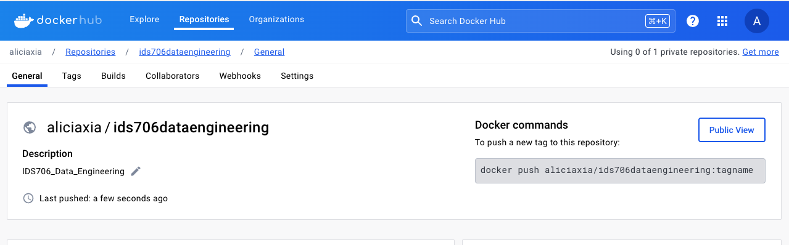
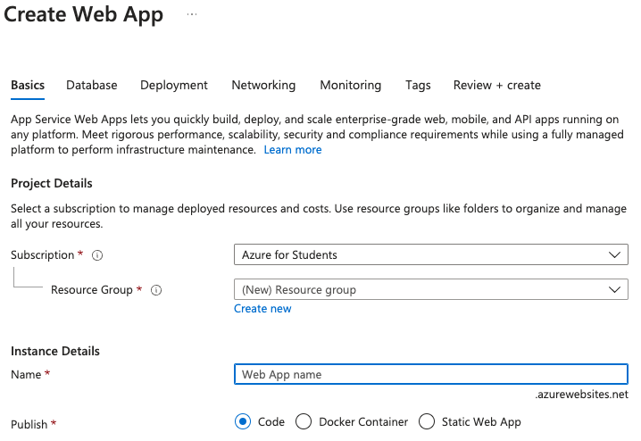
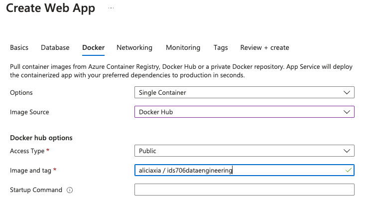
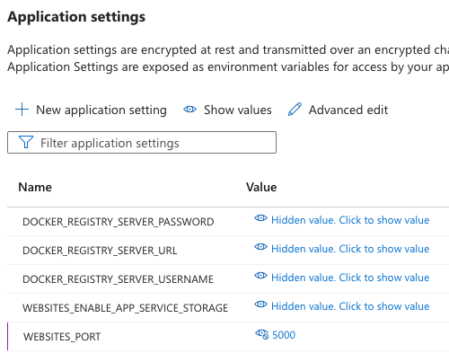
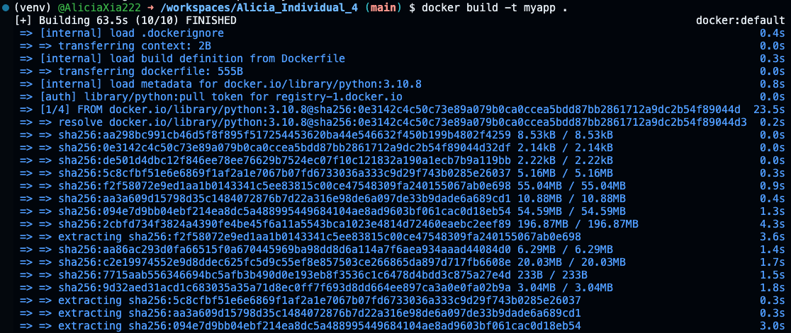
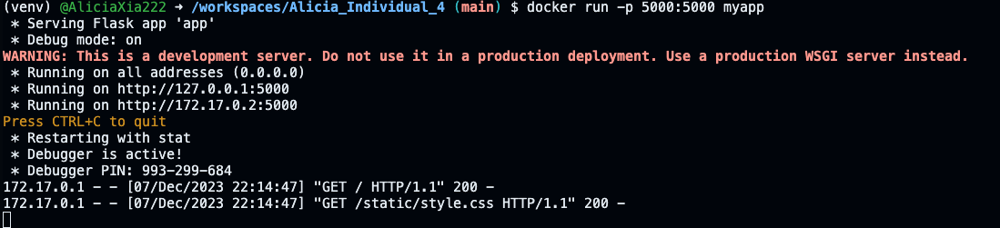
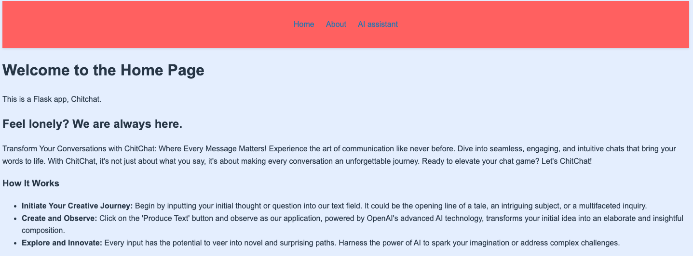
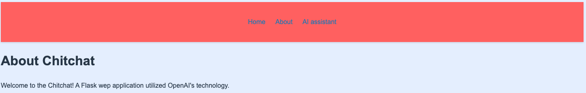
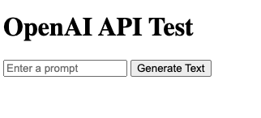
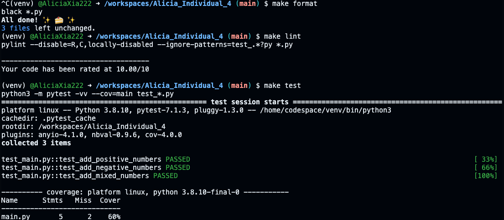

## Individual Project 4: Auto Scaling Flask App Using Any Platform As a Service
### Demo Video:

### Flask App Link:

[Chitchat](http://chitchat123.azurewebsites.net)

### Goal:

This project is aim to utilize with Generative AI technology to create a web chat application with Flask. And the development and deployment also integrates with Docker for containerization and Azure for cloud deployment and auto-scaling.

### File Tree:

```bash
.
├── Dockerfile
├── LICENSE
├── Makefile
├── README.md
├── app.py
├── main.py
├── repeat.sh
├── requirements.txt
├── setup.sh
├── static
│   └── style.css
├── templates
│   ├── about.html
│   ├── home.html
│   ├── index.html
│   └── prompt.html
└── test_main.py
```

## How to create and proceed this project

1. Create a Dockerhub account and a Docker Repository for incoming Docker image.

2. Log into the Azure
3. Find the App Services in search bar

4. Click on create "Web App", in "publish" option select "Docker Container", the app name gonna be at the start of your url.

5. Click on top session "Docker", select Image Source as "Docker Hub", copy paste the path of Docker repository from Docker hub and click "create" to create web app at last.

6. Navigate on the left menu, click on "Configuration" under Settings, click "New application setting" and set the port name as "WEBSITES_PORT" with value of 5000

7. Build the Docker Image
`docker build -t <yourimagename> .` Replace `yourimagename` with the name you wish to give to your 
Docker Hub later

8. Run the Docker Image(Optional)
`docker run -p 5000:5000 <yourimagename>`
5000 is your port value, remember? when you set it up in Azure Web service

9. Tag and Push/pull to Docker Hub:
If you create Dockerhub account with your github, 
`docker login`
`docker tag <yourimagename> <yourusername>/<yourrepository>:<yourtag>`
`docker push <yourusername>/<yourrepository:yourtag>`
If you are other people who want to see your Docker image,
`docker pull <yourimagename>/yourrepository:yourtag`

After doing all the above steps, now you can safari on my web page with the default domain provided on Azure.
Below is the screenshot of the webpage




And also the CI/CD passed

